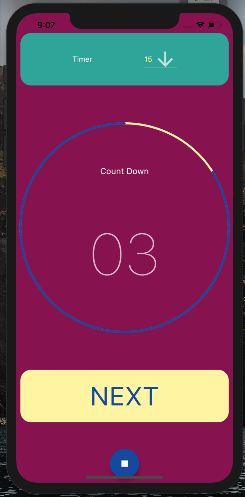

# Countdown counter 

Flutter application for table games.

If you want to play table game with time per player use this app.

You can set 15, 30, 60 and 90 seconds, when your turn ends tap on next, when your time is over counter will start automatically and a sound will notify the end of your turn.

You can use it with any table game.

